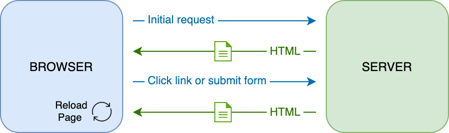
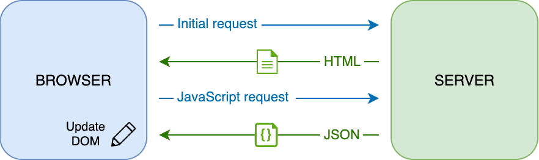

# Construindo um App de Banco Parte 3: Métodos de Fetching e Usos de Dados

## Quiz pré-lição

[Quiz pré-lição](https://ashy-river-0debb7803.1.azurestaticapps.net/quiz/45)

### Introdução

No centro de cada aplicação web existem *dados*. Os dados podem assumir diversas formas, mas seu objetivo principal é sempre exibir informações ao usuário. Com os aplicativos web se tornando cada vez mais interativos e complexos, a forma como o usuário acessa e interage com as informações é agora uma parte fundamental do desenvolvimento web.

Nesta lição, veremos como buscar dados de um servidor de forma assíncrona e usar esses dados para exibir informações em uma página da web sem recarregar o HTML.

### Pré-requisitos

Você precisa ter construído o [Formulário de Login e Registro](../2-formularios/README.md) do aplicativo web para essa lição. Precisa ter instalado o [Node.js](https://nodejs.org) e [rodar o servidor API](../api/README.md) localmente para obter os dados das contas.

Você pode verificar se o servidor está rodando de forma correnta executando o comando abaixo no terminal:

```sh
curl http://localhost:5000/api
# -> should return "Bank API v1.0.0" as a result
```

---

## AJAX e fetching dados

Os sites tradicionais atualizam o conteúdo exibido quando o usuário seleciona um link ou envia dados por meio de um formulário, recarregando a página HTML completa. Cada vez que novos dados precisam ser carregados, o servidor web retorna uma nova página HTML que precisa ser processada pelo navegador, interrompendo a ação atual do usuário e limitando as interações durante o recarregamento. Este fluxo de trabalho também é chamado de *Aplicativo de Várias Páginas* ou *MPA*.



Quando as aplicações web começaram a se tornar mais complexas e interativas, surgiu uma nova técnica chamada [AJAX (Asynchronous JavaScript and XML)](https://en.wikipedia.org/wiki/Ajax_(programming)). Essa técnica permite que aplicativos da web enviem e recuperem dados de um servidor de forma assíncrona usando JavaScript, sem precisar recarregar a página HTML, resultando em atualizações mais rápidas e interações mais suaves com o usuário. Quando novos dados são recebidos do servidor, a página HTML atual também pode ser atualizada com JavaScript usando a API [DOM](https://developer.mozilla.org/docs/Web/API/Document_Object_Model). Com o tempo, essa abordagem evoluiu para o que hoje é chamado de [*Aplicativo de Página Única* ou *SPA*](https://en.wikipedia.org/wiki/Single-page_application).



Quando o AJAX foi introduzido pela primeira vez, a única API disponível para buscar dados de forma assíncrona era [`XMLHttpRequest`](https://developer.mozilla.org/docs/Web/API/XMLHttpRequest/Using_XMLHttpRequest). Mas os navegadores modernos agora também implementam a [API `Fetch`](https://developer.mozilla.org/docs/Web/API/Fetch_API), mais conveniente e poderosa, que usa promises e é mais adequada para manipular dados JSON.

> Embora todos os navegadores modernos suportem a `Fetch API`, se você deseja que sua aplicação web funcione em navegadores legados ou antigos, é sempre uma boa ideia verificar a [tabela de compatibilidade em caniuse.com](https://caniuse.com/fetch) primeiro.

### Tarefa

Na [lição anterior](../2-forms/README.md) implementamos o formulário de registro para criar uma conta. Agora adicionaremos o código para fazer login usando uma conta existente e buscar seus dados. Abra o arquivo `app.js` e adicione uma nova função `login`:

```js
async function login() {
  const loginForm = document.getElementById('loginForm')
  const user = loginForm.user.value;
}
```

Aqui começamos recuperando o elemento do formulário com `getElementById()` e, em seguida, obtemos o nome de usuário da entrada com `loginForm.user.value`. Todo controle de formulário pode ser acessado pelo seu nome (definido no HTML usando o atributo `name`) como uma propriedade do formulário.

De forma semelhante ao que fizemos para o cadastro, criaremos outra função para realizar uma solicitação ao servidor, mas desta vez para recuperar os dados da conta:

```js
async function getAccount(user) {
  try {
    const response = await fetch('//localhost:5000/api/accounts/' + encodeURIComponent(user));
    return await response.json();
  } catch (error) {
    return { error: error.message || 'Unknown error' };
  }
}
```

Usamos a API `fetch` para solicitar os dados de forma assíncrona do servidor, mas desta vez não precisamos de nenhum parâmetro extra além da URL para chamar, pois estamos apenas consultando dados. Por padrão, `fetch` cria uma requisição HTTP [`GET`](https://developer.mozilla.org/docs/Web/HTTP/Methods/GET), que é o que estamos buscando aqui.

✅ `encodeURIComponent()` é uma função que escapa caracteres especiais para URL. Que problemas poderíamos ter se não chamarmos esta função e usarmos diretamente o valor `user` na URL?

Vamos agora atualizar nossa função `login` para usar `getAccount`:

```js
async function login() {
  const loginForm = document.getElementById('loginForm')
  const user = loginForm.user.value;
  const data = await getAccount(user);

  if (data.error) {
    return console.log('loginError', data.error);
  }

  account = data;
  navigate('/dashboard');
}
```

Primeiro, como `getAccount` é uma função assíncrona, precisamos combiná-la com a palavra-chave `await` para aguardar o resultado do servidor. Como acontece com qualquer solicitação de servidor, também temos que lidar com casos de erro. Por enquanto, adicionaremos apenas uma mensagem de log para exibir o erro e voltaremos a ela mais tarde.

Então temos que armazenar os dados em algum lugar para que possamos usá-los posteriormente para exibir as informações do painel. Como a variável `account` ainda não existe, criaremos uma variável global para ela no topo do nosso arquivo:

```js
let account = null;
```

Após os dados do usuário serem salvos em uma variável, podemos navegar da página *login* para o *dashboard* usando a função `navigate()` que já temos.

Finalmente, precisamos chamar nossa função `login` quando o formulário de login for enviado, modificando o HTML:

```html
<form id="loginForm" action="javascript:login()">
```

Teste se tudo está funcionando corretamente registrando uma nova conta e tentando fazer o login usando a mesma conta.

Antes de passar para a próxima parte, também podemos completar a função `register` adicionando isto na parte inferior da função:

```js
account = result;
navigate('/dashboard');
```

✅ Você sabia que, por padrão, você só pode chamar APIs de servidor do *mesmo domínio e porta* da página da web que está visualizando? Este é um mecanismo de segurança imposto pelos navegadores. Mas espere, nosso aplicativo web está rodando em `localhost:3000` enquanto a API do servidor está rodando em `localhost:5000`, por que funciona? Usando uma técnica chamada [Cross-Origin Resource Sharing (CORS)](https://developer.mozilla.org/docs/Web/HTTP/CORS), é possível realizar solicitações HTTP de origem cruzada se o servidor adicionar cabeçalhos especiais à resposta, permitindo exceções para domínios específicos.

> Saiba mais sobre APIs fazendo esta [lição](https://docs.microsoft.com/learn/modules/use-apis-discover-museum-art/?WT.mc_id=academic-77807-sagibbon)

## Atualizando HTML para mostrar dados

Agora que temos os dados do usuário, precisamos atualizar o HTML existente para exibi-los. Já sabemos como recuperar um elemento do DOM usando, por exemplo, `document.getElementById()`. Depois de ter um elemento base, aqui estão algumas APIs que você pode usar para modificá-lo ou adicionar elementos filhos a ele:

- Usando a propriedade [`textContent`](https://developer.mozilla.org/docs/Web/API/Node/textContent) você pode alterar o texto de um elemento. Observe que alterar esse valor remove todos os filhos do elemento (se houver) e o substitui pelo texto fornecido. Como tal, também é um método eficiente para remover todos os filhos de um determinado elemento, atribuindo uma string vazia `''` a ele.

- Usando [`document.createElement()`](https://developer.mozilla.org/docs/Web/API/Document/createElement) junto com o método [`append()`](https://developer.mozilla.org/docs/Web/API/ParentNode/append) você pode criar e anexar um ou mais novos elementos filhos.

✅ Usando a propriedade [`innerHTML`](https://developer.mozilla.org/docs/Web/API/Element/innerHTML) de um elemento também é possível alterar seu conteúdo HTML, mas isso deve ser evitado devido deixar vulnerável a ataques de [cross-site scripting (XSS)](https://developer.mozilla.org/docs/Glossary/Cross-site_scripting).

### Tarefa

Antes de passar para a tela do painel, há mais uma coisa que devemos fazer na página *login*. Atualmente, se você tentar fazer login com um nome de usuário que não existe, uma mensagem será mostrada no console, mas para um usuário normal nada muda e você não sabe o que está acontecendo.

Vamos adicionar um elemento de espaço reservado no formulário de login onde podemos exibir uma mensagem de erro, se necessário. Um bom lugar seria logo antes do login `<button>`:

```html
...
<div id="loginError"></div>
<button>Login</button>
...
```

Este elemento `<div>` está vazio, o que significa que nada será exibido na tela até que adicionemos algum conteúdo a ele. Também damos a ele um `id` para que possamos recuperá-lo facilmente com JavaScript.

Volte para o arquivo `app.js` e crie uma nova função auxiliar `updateElement`:

```js
function updateElement(id, text) {
  const element = document.getElementById(id);
  element.textContent = text;
}
```

Este é bastante simples: dado um elemento *id* e *text*, ele atualizará o conteúdo de texto do elemento DOM com o `id` correspondente. Vamos usar este método no lugar da mensagem de erro anterior na função `login`:

```js
if (data.error) {
  return updateElement('loginError', data.error);
}
```

Agora tente fazer login com uma conta inválida, você verá a mensagem de erro.

Agora temos um texto de erro que aparece visualmente, mas se você tentar com um leitor de tela perceberá que nada é anunciado. Para que o texto adicionado dinamicamente a uma página seja anunciado pelos leitores de tela, será necessário usar algo chamado [Live Region](https://developer.mozilla.org/docs/Web/Accessibility/ARIA/ARIA_Live_Regions). Aqui usaremos um tipo específico de região ativa chamada alerta:

```html
<div id="loginError" role="alert"></div>
```

Implemente o mesmo comportamento para os erros da função `register` (não se esqueça de atualizar o HTML).

## Exibir informações no painel

Usando as mesmas técnicas que acabamos de ver, também cuidaremos de exibir as informações da conta na página do painel.

Esta é a aparência de um objeto de conta recebido do servidor:

```json
{
  "user": "test",
  "currency": "$",
  "description": "Test account",
  "balance": 75,
  "transactions": [
    { "id": "1", "date": "2020-10-01", "object": "Pocket money", "amount": 50 },
    { "id": "2", "date": "2020-10-03", "object": "Book", "amount": -10 },
    { "id": "3", "date": "2020-10-04", "object": "Sandwich", "amount": -5 }
  ],
}
```

> Nota: para facilitar sua vida, você pode usar a conta `teste` pré-existente que já está preenchida com dados.

### Tarefa

Vamos começar substituindo a seção “Saldo” no HTML para adicionar elementos de espaço reservado:

```html
<section>
  Balanço: <span id="balance"></span><span id="currency"></span>
</section>
```

Também adicionaremos uma nova seção logo abaixo para exibir a descrição da conta:

```html
<h2 id="description"></h2>
```

✅ Como a descrição da conta funciona como um título para o conteúdo abaixo dela, ela é marcada semanticamente como um título. Aprender mais sobre [heading structure](https://www.nomensa.com/blog/2017/how-structure-headings-web-accessibility) é importante para a acessibilidade e dê uma olhada crítica na página para determinar o que mais poderia ser um título.

A seguir, criaremos uma nova função em `app.js` para preencher o espaço reservado:

```js
function updateDashboard() {
  if (!account) {
    return navigate('/login');
  }

  updateElement('description', account.description);
  updateElement('balance', account.balance.toFixed(2));
  updateElement('currency', account.currency);
}
```

Primeiro, verificamos se temos os dados da conta necessários antes de prosseguir. Então usamos a função `updateElement()` que criamos anteriormente para atualizar o HTML.

> Para deixar a exibição da balança mais bonita, usamos o método [`toFixed(2)`](https://developer.mozilla.org/docs/Web/JavaScript/Reference/Global_Objects/Number/toFixed) para forçar a exibição do valor com 2 dígitos após o decimal.

Agora precisamos chamar nossa função `updateDashboard()` toda vez que o painel for carregado.

Adicione este código ao final da função `updateRoute()`:

```js
if (typeof route.init === 'function') {
  route.init();
}
```

E atualize a definição de rotas com:

```js
const routes = {
  '/login': { templateId: 'login' },
  '/dashboard': { templateId: 'dashboard', init: updateDashboard }
};
```

Com esta mudança, toda vez que a página do dashboard é exibida, a função `updateDashboard()` é chamada. Após o login, você poderá ver o saldo da conta, a moeda e a descrição.

## Crie linhas de tabela dinamicamente com modelos HTML

Ná [primeira lição](../1-template-route/README.md) nós usamos templates HTML junto com o método [`appendChild()`](https://developer.mozilla.org/docs/Web/API/Node/appendChild) para implementar a navegação em nosso aplicativo. Os modelos também podem ser menores e usados para preencher dinamicamente partes repetitivas de uma página.

Usaremos uma abordagem semelhante para exibir a lista de transações na tabela HTML.

### Tarefa

Adicione um novo template no HTML `<body>`:

```html
<template id="transaction">
  <tr>
    <td></td>
    <td></td>
    <td></td>
  </tr>
</template>
```

Este template representa uma única linha da tabela, com as 3 colunas que queremos preencher: *data*, *objeto* e *valor* de uma transação.

Em seguida, adicione esta propriedade `id` ao elemento `<tbody>` da tabela dentro do modelo de painel para facilitar a localização usando JavaScript:

```html
<tbody id="transactions"></tbody>
```

Nosso HTML está pronto, vamos mudar para o código JavaScript e criar uma nova função `createTransactionRow`:

```js
function createTransactionRow(transaction) {
  const template = document.getElementById('transaction');
  const transactionRow = template.content.cloneNode(true);
  const tr = transactionRow.querySelector('tr');
  tr.children[0].textContent = transaction.date;
  tr.children[1].textContent = transaction.object;
  tr.children[2].textContent = transaction.amount.toFixed(2);
  return transactionRow;
}
```

Esta função faz exatamente o que seu nome indica: usando o modelo que criamos anteriormente, ela cria uma nova linha da tabela e preenche seu conteúdo usando dados de transação. Usaremos isso em nossa função `updateDashboard()` para preencher a tabela:

```js
const transactionsRows = document.createDocumentFragment();
for (const transaction of account.transactions) {
  const transactionRow = createTransactionRow(transaction);
  transactionsRows.appendChild(transactionRow);
}
updateElement('transactions', transactionsRows);
```

Aqui nós usamos o método [`document.createDocumentFragment()`](https://developer.mozilla.org/docs/Web/API/Document/createDocumentFragment) isso cria um novo fragmento DOM no qual podemos trabalhar, antes de finalmente anexá-lo à nossa tabela HTML.

Ainda há mais uma coisa que precisamos fazer antes que este código possa funcionar, já que nossa função `updateElement()` atualmente suporta apenas conteúdo de texto. Vamos mudar um pouco seu código:

```js
function updateElement(id, textOrNode) {
  const element = document.getElementById(id);
  element.textContent = ''; // Removes all children
  element.append(textOrNode);
}
```

Nós usamos o método [`append()`](https://developer.mozilla.org/docs/Web/API/ParentNode/append) pois permite anexar texto ou [Nodos DOM](https://developer.mozilla.org/docs/Web/API/Node) para um elemento pai, o que é perfeito para todos os nossos casos de uso.

Se você tentar usar a conta `test` para fazer login, você deverá ver uma lista de transações no painel 🎉.

---

## 🚀 Desafio

Trabalhe em conjunto para fazer com que a página do painel pareça um aplicativo bancário real. Se você já estilizou seu aplicativo, tente usar [media queries](https://developer.mozilla.org/docs/Web/CSS/Media_Queries) para criar um [design responsivo](https://developer.mozilla.org/docs/Web/Progressive_web_apps/Responsive/responsive_design_building_blocks) funcionando bem em desktops e dispositivos móveis.

## Quiz pós-lição

[Quiz pós-lição](https://ashy-river-0debb7803.1.azurestaticapps.net/quiz/46)

## Atribuição

# Refactor and comment your code

## Instructions

As your codebase grows, it's important to refactor your code frequently to keep it readable and maintainable over time. Add comments and refactor your `app.js` to improve the code quality:

- Extract constants, like the server API base URL
- Factorize similar code: for example you can create a `sendRequest()` function to regroup the code used in both `createAccount()` and `getAccount()`
- Reorganize the code to make it easier to read, and add comments

## Rubric

| Criteria | Exemplary                                                                                                                                                     | Adequate                                                                                          | Needs Improvement                                                                     |
| -------- | ------------------------------------------------------------------------------------------------------------------------------------------------------------- | ------------------------------------------------------------------------------------------------- | ------------------------------------------------------------------------------------- |
|          | Code is commented, well-organized in different sections and easy to read. Constants are extracted and a factorized `sendRequest()` function has been created. | Code is clean but can still be improved with more comments, constant extraction or factorization. | Code is messy, not commented, constants are not extracted and code is not factorized. |
