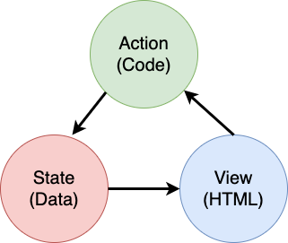

# Construindo um Aplicativo de Banco Parte 4: Conceitos de Gestão do Estado

## Quiz pré-lição

[Quiz pré-lição](https://ashy-river-0debb7803.1.azurestaticapps.net/quiz/47)

### Introdução

À medida que uma aplicação web cresce, torna-se um desafio acompanhar todos os fluxos de dados. Qual código obtém os dados, qual página os consome, onde e quando eles precisam ser atualizados... é fácil acabar com um código confuso e difícil de manter. Isso é especialmente verdadeiro quando você precisa compartilhar dados entre diferentes páginas do seu aplicativo, por exemplo, dados do usuário. O conceito de *gestão de estado* sempre existiu em todos os tipos de programas, mas à medida que as aplicações web continuam a crescer em complexidade, este é agora um ponto-chave a considerar durante o desenvolvimento.

Nesta parte final, examinaremos o aplicativo que construímos para repensar como o estado é gerenciado, permitindo suporte para atualização do navegador a qualquer momento e dados persistentes nas sessões do usuário.

### Pré-requisito

Você precisa ter completado a parte de [data fetching](../3-dados/README.md) do aplicativo web para essa lição. Precisa ter instalado o [Node.js](https://nodejs.org) e [rodar o servidor API](../api/README.md) localmente para você conseguir gerir os dados das contas.

Você pode testar se o servidor está funcionando corretamente executando este comando em um terminal:

```sh
curl http://localhost:5000/api
# -> should return "Bank API v1.0.0" as a result
```

---

## Repensando com gestão do estado

Na [lição anterior](../3-dados/README.md), introduzimos um conceito básico de estado em nosso aplicativo com a variável global `account` que contém os dados bancários do usuário atualmente logado. No entanto, nossa implementação atual apresenta algumas falhas. Tente atualizar a página quando estiver no painel. O que acontece?

Existem 3 problemas com o código atual:

- O estado não é persistente, pois uma atualização do navegador leva você de volta à página de login.
- Existem múltiplas funções que modificam o estado. À medida que o aplicativo cresce, pode ser difícil rastrear as alterações e é fácil esquecer de atualizá-lo.
- O estado não é limpo, então quando você clica em *Logout* os dados da conta ainda estão lá mesmo que você esteja na página de login.

Poderíamos atualizar nosso código para resolver esses problemas um por um, mas isso criaria mais duplicação de código e tornaria o aplicativo mais complexo e difícil de manter. Ou poderíamos fazer uma pausa por alguns minutos e repensar a nossa estratégia.

> Que problemas estamos realmente tentando resolver aqui?

[Manejamento de Estado](https://en.wikipedia.org/wiki/State_management) trata-se de encontrar uma boa abordagem para resolver estes dois problemas específicos:

- Como manter os fluxos de dados em um aplicativo compreensíveis?
- Como manter os dados de estado sempre sincronizados com a interface do usuário (e vice-versa)?

Depois de cuidar disso, quaisquer outros problemas que você possa ter podem já ter sido corrigidos ou ter se tornado mais fáceis de corrigir. Existem muitas abordagens possíveis para resolver esses problemas, mas optaremos por uma solução comum que consiste em **centralizar os dados e as formas de alterá-los**. Os fluxos de dados seriam assim:



> Não abordaremos aqui a parte em que os dados acionam automaticamente a atualização da visualização, pois estão vinculados a conceitos mais avançados de [Programas Reativos](https://en.wikipedia.org/wiki/Reactive_programming). É um bom assunto para acompanhamento se você quiser se aprofundar.

✅ Existem muitas bibliotecas por aí com diferentes abordagens para a gestão do estado, [Redux](https://redux.js.org) tem sido uma opção popular. Dê uma olhada nos conceitos e padrões usados, pois geralmente é uma boa maneira de saber quais problemas potenciais você pode estar enfrentando em grandes aplicativos da web e como eles podem ser resolvidos.

### Tarefa

Começaremos com um pouco de refatoração. Substitua a declaração `account`:

```js
let account = null;
```

Por:

```js
let state = {
  account: null
};
```

A ideia é *centralizar* todos os dados do nosso aplicativo em um único objeto de estado. Só temos `conta` por enquanto no estado então não muda muita coisa, mas cria um caminho para evoluções.

Também temos que atualizar as funções que o utilizam. Nas funções `register()` e `login()`, substitua `account = ...` por `state.account = ...`;

No topo da função `updateDashboard()`, adicione esta linha:

```js
const account = state.account;
```

Essa refatoração por si só não trouxe muitas melhorias, mas a ideia era lançar as bases para as próximas mudanças.

## Rastreie alterações de dados

Agora que implementamos o objeto `state` para armazenar nossos dados, o próximo passo é centralizar as atualizações. O objetivo é tornar mais fácil acompanhar quaisquer alterações e quando elas acontecem.

Para evitar alterações no objeto `state`, também é uma boa prática considerá-lo [*imutável*](https://en.wikipedia.org/wiki/Immutable_object), o que significa que não pode ser modificado de forma alguma. Isso também significa que você terá que criar um novo objeto de estado se quiser alterar alguma coisa nele. Ao fazer isso, você cria uma proteção contra [efeitos colaterais](https://en.wikipedia.org/wiki/Side_effect_(computer_science)) potencialmente indesejados, e abre possibilidades para novos recursos em seu aplicativo, como implementar desfazer/refazer, ao mesmo tempo que facilita a depuração. Por exemplo, você pode registrar todas as alterações feitas no estado e manter um histórico das alterações para entender a origem de um bug.

Em JavaScript, você pode usar [`Object.freeze()`](https://developer.mozilla.org/docs/Web/JavaScript/Reference/Global_Objects/Object/freeze) para criar uma versão imutável de um objeto. Se você tentar fazer alterações em um objeto imutável, uma exceção será gerada.

✅ Você sabe a diferença entre um objeto imutável *superficial* e um objeto *profundo*? Você pode ler sobre isso [aqui](https://developer.mozilla.org/docs/Web/JavaScript/Reference/Global_Objects/Object/freeze#What_is_shallow_freeze).

### Tarefa

Vamos criar uma nova função `updateState()`:

```js
function updateState(property, newData) {
  state = Object.freeze({
    ...state,
    [property]: newData
  });
}
```

Nesta função, estamos criando um novo objeto de estado e copiando os dados do estado anterior usando o [*operador de espalhamento (`...`)*](https://developer.mozilla.org/docs/Web/JavaScript/Reference/Operators/Spread_syntax#Spread_in_object_literals). Em seguida, substituímos uma propriedade específica do objeto de estado pelos novos dados usando a [notação de colchetes](https://developer.mozilla.org/docs/Web/JavaScript/Guide/Working_with_Objects#Objects_and_properties) `[property]` para atribuição. Finalmente, bloqueamos o objeto para evitar modificações usando `Object.freeze()`. Por enquanto, temos apenas a propriedade `account` armazenada no estado, mas com essa abordagem você pode adicionar quantas propriedades precisar no estado.

Também atualizaremos a inicialização do `state` para garantir que o estado inicial também esteja congelado:

```js
let state = Object.freeze({
  account: null
});
```

Depois disso, atualize a função `register` substituindo a atribuição `state.account = result;` por:

```js
updateState('account', result);
```

Faça o mesmo com a função `login`, substituindo `state.account = data;` por:

```js
updateState('account', data);
```

Aproveitaremos agora para corrigir o problema de os dados da conta não serem apagados quando o usuário clica em *Sair*.

Crie uma nova função `logout()`:

```js
function logout() {
  updateState('account', null);
  navigate('/login');
}
```

Em `updateDashboard()`, substitua o redirecionamento `return navigate('/login');` por `return logout()`;

Experimente registrar uma nova conta, sair e entrar novamente para verificar se tudo ainda funciona corretamente.

> Dica: você pode dar uma olhada em todas as mudanças de estado adicionando `console.log(state)` na parte inferior de `updateState()` e abrindo o console nas ferramentas de desenvolvimento do seu navegador.

## Persistir o Estado

A maioria dos aplicativos da web precisa persistir os dados para funcionar corretamente. Todos os dados críticos são geralmente armazenados em um banco de dados e acessados ​​por meio de uma API de servidor, como os dados da conta do usuário no nosso caso. Mas às vezes também é interessante persistir alguns dados no aplicativo cliente que está rodando no seu navegador, para uma melhor experiência do usuário ou para melhorar o desempenho de carregamento.

Quando você deseja manter dados em seu navegador, há algumas perguntas importantes que você deve se fazer:

- *Os dados são confidenciais?* Você deve evitar armazenar dados confidenciais no cliente, como senhas de usuários.
- *Por quanto tempo você precisa manter esses dados?* Você planeja acessar esses dados apenas para a sessão atual ou deseja que eles sejam armazenados para sempre?

Existem várias maneiras de armazenar informações dentro de um aplicativo da web, dependendo do que você deseja alcançar. Por exemplo, você pode usar URLs para armazenar uma consulta de pesquisa e torná-la compartilhável entre usuários. Você também pode usar [cookies HTTP](https://developer.mozilla.org/docs/Web/HTTP/Cookies) se os dados precisarem ser compartilhados com o servidor, como informações de [autenticação](https://en.wikipedia.org/wiki/Authentication).

Outra opção é usar uma das muitas APIs do navegador para armazenar dados. Dois deles são particularmente interessantes:

- [`localStorage`](https://developer.mozilla.org/docs/Web/API/Window/localStorage): um [armazenamento de Key/Value](https://en.wikipedia.org/wiki/Key%E2%80%93value_database) permitindo persistir dados específicos do site atual em diferentes sessões. Os dados salvos nele nunca expiram.
- [`sessionStorage`](https://developer.mozilla.org/docs/Web/API/Window/sessionStorage): este funciona da mesma forma que `localStorage` exceto que os dados armazenados nele são apagados quando a sessão termina (quando o navegador é fechado).

Observe que ambas as APIs permitem apenas armazenar [strings](https://developer.mozilla.org/docs/Web/JavaScript/Reference/Global_Objects/String). Se você quiser armazenar objetos complexos, você precisará serializá-los para o formato [JSON](https://developer.mozilla.org/docs/Web/JavaScript/Reference/Global_Objects/JSON) usando [`JSON.stringify()`](https://developer.mozilla.org/docs/Web/JavaScript/Reference/Global_Objects/JSON/stringify).

✅ Se você deseja criar uma aplicação web que não funcione com um servidor, também é possível criar um banco de dados no cliente usando o comando [`IndexedDB` API](https://developer.mozilla.org/docs/Web/API/IndexedDB_API). Este é reservado para casos de uso avançados ou se você precisar armazenar uma quantidade significativa de dados, pois é mais complexo de usar.

### Tarefa

Queremos que nossos usuários permaneçam logados até clicarem explicitamente no botão *Logout*, então usaremos `localStorage` para armazenar os dados da conta. Primeiro, vamos definir uma chave que usaremos para armazenar nossos dados.

```js
const storageKey = 'savedAccount';
```

Em seguida, adicione esta linha no final da função `updateState()`:

```js
localStorage.setItem(storageKey, JSON.stringify(state.account));
```

Com isso, os dados da conta do usuário serão persistidos e sempre atualizados, pois centralizamos previamente todas as nossas atualizações de estado. É aqui que começamos a nos beneficiar de todos os nossos refatoradores anteriores 🙂.

À medida que os dados são salvos, também temos que cuidar de restaurá-los quando o aplicativo é carregado. Como começaremos a ter mais código de inicialização, pode ser uma boa ideia criar uma nova função `init`, que também inclua nosso código anterior na parte inferior do `app.js`:

```js
function init() {
  const savedAccount = localStorage.getItem(storageKey);
  if (savedAccount) {
    updateState('account', JSON.parse(savedAccount));
  }

  // Our previous initialization code
  window.onpopstate = () => updateRoute();
  updateRoute();
}

init();
```

Aqui recuperamos os dados salvos e, se houver, atualizamos o estado de acordo. É importante fazer isso *antes* de atualizar a rota, pois pode haver código dependendo do estado durante a atualização da página.

Também podemos tornar a página *Dashboard* a página padrão do aplicativo, pois agora estamos persistindo os dados da conta. Se nenhum dado for encontrado, o painel se encarrega de redirecionar para a página *Login* de qualquer maneira. Em `updateRoute()`, substitua o substituto `return navigate('/login');` por `return navigate('/dashboard');`.

Agora faça login no aplicativo e tente atualizar a página. Você deve permanecer no painel. Com essa atualização, resolvemos todos os nossos problemas iniciais...

## Atualize os dados

...Mas também podemos ter criado um novo. Ops!

Vá para o painel usando a conta `test` e execute este comando em um terminal para criar uma nova transação:

```sh
curl --request POST \
     --header "Content-Type: application/json" \
     --data "{ \"date\": \"2020-07-24\", \"object\": \"Bought book\", \"amount\": -20 }" \
     http://localhost:5000/api/accounts/test/transactions
```

Tente atualizar a página do painel no navegador agora. O que acontece? Você vê a nova transação?

O estado persiste indefinidamente graças ao `localStorage`, mas isso também significa que ele nunca é atualizado até que você saia do aplicativo e faça login novamente!

Uma estratégia possível para corrigir isso é recarregar os dados da conta toda vez que o painel é carregado, para evitar travamento de dados.

### Tarefa

Crie uma nova função `updateAccountData`:

```js
async function updateAccountData() {
  const account = state.account;
  if (!account) {
    return logout();
  }

  const data = await getAccount(account.user);
  if (data.error) {
    return logout();
  }

  updateState('account', data);
}
```

Este método verifica se estamos logados no momento e recarrega os dados da conta do servidor.

Crie outra função chamada `refresh`:

```js
async function refresh() {
  await updateAccountData();
  updateDashboard();
}
```

Este atualiza os dados da conta e depois se encarrega de atualizar o HTML da página do painel. É o que precisamos chamar quando a rota do painel for carregada. Atualize a definição da rota com:

```js
const routes = {
  '/login': { templateId: 'login' },
  '/dashboard': { templateId: 'dashboard', init: refresh }
};
```

Tente recarregar o painel agora, ele deverá exibir os dados atualizados da conta.

---

## 🚀 Desafio

Agora que recarregamos os dados da conta sempre que o painel é carregado, você acha que ainda precisamos persistir *todos os dados da conta*?

Tente trabalhar em conjunto para alterar o que é salvo e carregado em `localStorage` para incluir apenas o que é absolutamente necessário para o funcionamento do aplicativo.

## Quiz pós-lição

[Quiz pós-lição](https://ashy-river-0debb7803.1.azurestaticapps.net/quiz/48)

## Atribuição

# Implementar a caixa de diálogo "Adicionar transação"

## Instruções

Nosso aplicativo bancário ainda carece de um recurso importante: a possibilidade de inserir novas transações.
Usando tudo o que você aprendeu nas quatro lições anteriores, implemente uma caixa de diálogo "Adicionar transação":

- Adicione um botão "Adicionar transação" na página do painel
- Crie uma nova página com um modelo HTML ou use JavaScript para mostrar/ocultar a caixa de diálogo HTML sem sair da página do painel (você pode usar a propriedade [`hidden`](https://developer.mozilla.org/docs/Web/HTML/Global_attributes/hidden) para isso, ou classes CSS)
- Implementar um formulário HTML para receber dados de entrada
- Crie dados JSON a partir dos dados do formulário e envie-os para a API
- Atualize a página do painel com os novos dados

Consulte as [especificações da API do servidor](../api/README.md) para ver qual API você precisa chamar e qual é o formato JSON esperado.

## Gabarito

| Criterio | Exemplar                                                                                        | Adequado                                                                                                                | Precisa de Melhorias                           |
| -------- | ------------------------------------------------------------------------------------------------ | ----------------------------------------------------------------------------------------------------------------------- | --------------------------------------------|
|          | A adição de uma transação é implementada completamente seguindo todas as práticas recomendadas vistas nas lições. | Adicionar uma transação é implementado, mas não segue as melhores práticas vistas nas lições, ou funciona apenas parcialmente. | Adicionar uma transação não está funcionando. |


Aqui está um exemplo de resultado após concluir a tarefa:


